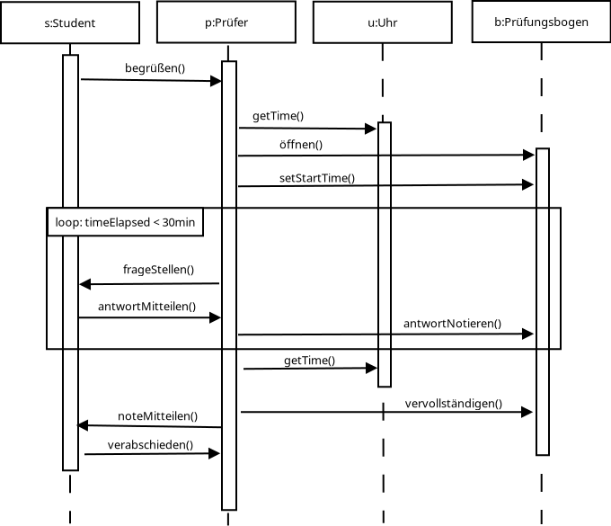

## Begriffe zum Versionsmanagement
- add - Datei zur "Staging area" hinzufügen
- push - remote mit lokalen commits updaten
- fetch - download commits von remote, ohne lokale Änderungen zu verwerfen
- checkout - zu einer anderen working branch wechseln
- pull - alle updates von remote ziehen

### Unterschied zwischen Commit und push
- push - zu remote repository pushen
- commit - lokalen commit/"snapshot" erstellen

### Konflikt und wie lösen
- bei Konflikten bei:
	→ merge
	→ rebase
	→ cherry pick
- z.b. wenn in 2 branches die selben Zeilen verändert wurden
- git merge --abort (undo the merge)
- Konflikte sind in den Datein markiert und können so manuell beseitigt werden

### Unterschied zwischen SVN und GIT
- git: jeder hat das komplette project und historie, kann also auch offline arbeiten
und später die Änderungen einbinden.
- svn: einzelne dateien von server beziehen und Änderungen dann wieder in zentrales repository
einbinden

## Versionsmanagement Praxis
### Notizen zu git
local working area (add)→ staging area (commit)→ local git history/repo (push)→remote repo

- git init : start tracking the current directory
- git stuats : shows the "status" of modified files
- git clone : remote repository lokal kopieren

- git ls-files : list files in staging area
- git rm <file> : remove from working directory and staging area also
- git mv <file> <new_file> : rename files
- git status -s : short status (SW <file>)
- git diff : see what was modified
- git diff --staged : see what will be commited in the next commit
- git log : view history
- git log --oneline --reverse : view history in reverse order as one line commits
- git show <id> : inspect a commit
- git restore --staged <file> : remove file from the staged area
- git restore <file> : undo local changes in a file
- git clean -fd : remove new untracked files
- git restore --source=<commit_id> <file> : restore file from a previous commit
- git config --global alias.something “commit -am” : create and alias called something

- git stash : pushes local changes on a stack
- git stash save <name> : saves changes to the stack under a name
- git stash pop : pop changes from the stack back to the local working branch
- git stash list : list all items on the stack
- git stash apply <index> : get the changes back from the stack

- git branch -a : list all branches
- git branch <name> : create new working branch
- git checkout <name> : switch to another branch
- git push -u origin <name> : create local branch on remote
- git merge <name> : call from updated master branch! Merges a branch back to master
- git branch --merged : lists merged branches
- git branch -d <name> : delete branch locally
- git branch push origin --delete <name> : delete branch from remote

Ignoring files:
- add files and dirs to .gitignore file
   → or dir/ for directories
- git rm --cached <file> : stop tracking file
   → git rm --chached -r <dir>/ : stop tracking directory (removed from staging area)

## Sequenzdiagramme

### Prüfung

### Amozahnbestellung

