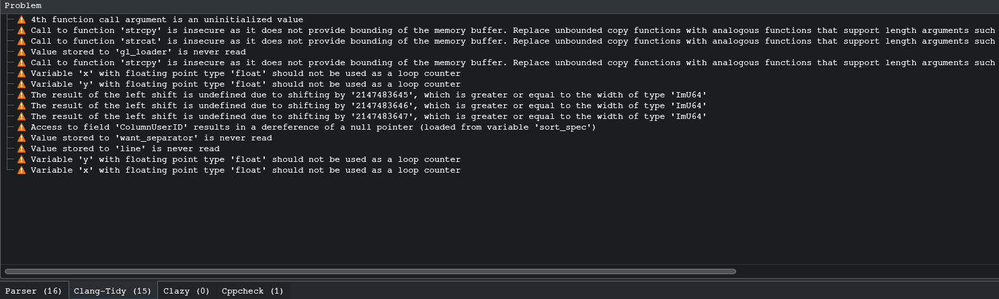

# Übungsblatt 7

## Auswahl geeigneter Prozessmodelle
### Filter zur Übertragung von Stammdaten
V-Modell würde sich hier eignen:
	- unit tests
	- integreationstest
	- system test

Es muss hier sichergestellt werden dass dieses Feature fehlerfrei abläuft zudem kommen vermutlich
keine neuen Features hinzu und muss nach der Fertigstellung / Umstellung auf das neue System nicht
weiter gewartet werden.

### Entwicklung einer Web-Version eines C++ Programms
Code and Fix. Spezifikation steht bereits.
	- schnelle Entwicklung
	- spezifikation kann nicht korrigiert werden

### Online-Plattform für Studierende
Agiles Modell / Scrum:
	- schnell Basis version verfügbar
	- features können schnell hinzugefügt und modifiziert werden

### Krankenhausinformationssytem
V-Modell oder Wasserfallmodell (ähnlich wie 1)

### Hochschul-Verwaltungssytem
V-Modell, Wasserfallmodell oder Scrum

### audio-visuelle Unterstützung von Vorlesungen 
Scrum:
	- schnell funktionale basis Version
	- Flexibel genug für Anpassungen nach Feedback

### Java Komponente für Mahnwesen
Code and fix mit Unit tests

## Scrum Wissenfragen
### Agile Methoden:
- reduzieren das Fehlschlagen von Projekten
- fördern die Zusammenarbeit der Beteiligten

### Der Product Owner ist dafür verantwortlich, dass...
- das Team die Anforderungen der Kunden versteht.

### In welcher Situation sollte man Scrum nicht einführen?
- Wenn man die Kontrolle nicht an das Team übergeben kann oder möchte

### Was ist kein zentraler Aspekt von Scrum?
- Unter allen Umständen sicherstellen, dass jede Anforderungen umgesetzt wird, bevor das Produkt dem Kunden ausgeliefert wird.

### Welche Aussge trifft nicht auf das Product Backlog zu
- Der Product Owner entscheided allein über die Priorität aller Anforderungen

## Agiles Projektmanagement mit Scrum
### User stories:
- Die Mitarbeiter sollen sich über eine Budget Karte authentifizieren können (2 story points)
- Als adminsitrator soll ein tool zur verfügung stehen um die Software zu verwalten (8 story points)
- Mitarbeiter sollen eine Büchungsübersicht haben, mit der sie sich über ihre Lohnauszahlungen informieren können (5 story points)
- Dit Mitarbeiter sollen sich über ihren Fingerabdruck authentifizieren können (2 story points)

## CheckStyle
- über eclipse marketplace installieren
- in Preferences -> Checkstyle kann man das plugin verwalten
- Google Checks aktivieren um auf die Google Konventionen zu testen
- Checkstyle für das spezifische Projekt anschalten

Erkennt die Verstöße gegen den Coding style als error in der Eclipse IDE

## In C++
- Clang-Tidy
- Clazy
- cppcheck

- unbenutzte variablen, 
- triviale memory leaks
- float als loop counter
- unsichere argumente zu strcpy und strcat

